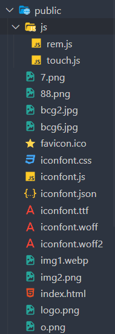

# 2021-2022学年第2学期

# **实 验 报 告**


- 课程名称:跨平台脚本开发技术
- 实验项目:  期末大作业
- 专业班级__计算1903_
- 学生学号__31901072_
- 学生姓名_高扬__
- 实验指导教师:郭鸣

## 实验内容

1. 现有改进方式建议列表

   - 开发技术
     - UI 响应式设计
       - 采用 BootStrap, Material Design等前端框架
       - 支持 Desktop,Tablet,Mobile
     - 服务端 NodeJs框架
       - Express、Koa等实现服务端
     - WebSocket socket.io等实时交互技术
     - Web Assembly 技术
2. 项目分工表格

   - 1人项目权重为1.0
   - 2人项目权重和为 1.9

   | 姓名 |   学号   |     班级 | 任务 | 权重 |
   | :--- | :------: | -------: | ---: | ---: |
   | 高扬 | 31901072 | 计算1903 | 全部 |    1 |
3. 项目自我评估表

   | 技术点            | 自评等级:(1-5) | 备注       |
   | :---------------- | :------------: | ---------- |
   | vue               |       5       |            |
   | el-ui             |       5       |            |
   | UI 响应式设计     |       5       | 支持移动端 |
   | 服务端 NodeJs框架 |       5       | express    |
   | Mysql             |       5       |            |
4. 项目说明

   1. 项目 是独立开发
   2. 分为前端与后端，后端通过nodejs结合express框架与mysql框架，来实现从数据库获取数据，并且传递给前端。前端通过vue中el-ui来进行编写。通过其axios获取后端提供的数据。其中前端分为管理员与用户两个方面，用户中2048游戏代码参考了网络上部分的2048教程。
   3. 后端：项目目录

      ```
      app.js 主启动程序 mysql.js 数据库连接 routers.js各个路由 sqlMap.js 
      ```
   4. 前端：项目目录

      ```
      js文件夹：rem.js设置设备rem宽高,touch.js触摸屏幕相应动作，其余为头像与icon库
      vue文件夹：assets：图片，components：组件页面，LoginView：登录界面，RankView：排行表，router：路由，admin：管理员页面自上而下分别为HomeView：主页，InsertView：插入新用户,SearchView：查找用户（包含删改）user：GameView：2048页面 HomeView：主页
      ```
   5. 前端启动：`npm run serve`

      
   6. 后端启动：`node app.js`

      
5. 解决技术要点说明

   - 解决 xxx 问题1， 关键代码与步骤如下
   - 解决 xxx 问题2， 关键代码与步骤如下
6. 心得体会（结合自己情况具体说明）

   - 大项目开发过程心得
     - 遇到哪些困难，经历哪里过程，有哪些收获
   - 本课程建议
     - 课程难度方面，进度方面，课程内容，授课方式等，给出你的意见
