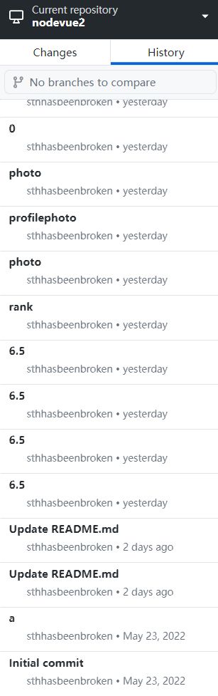
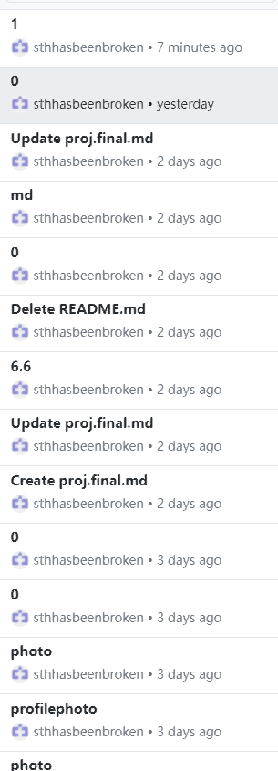
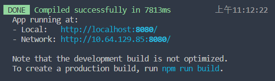
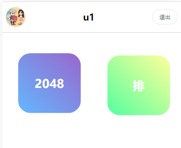
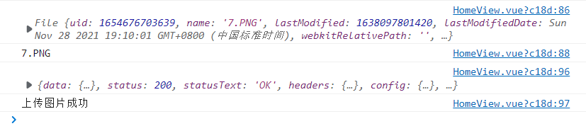
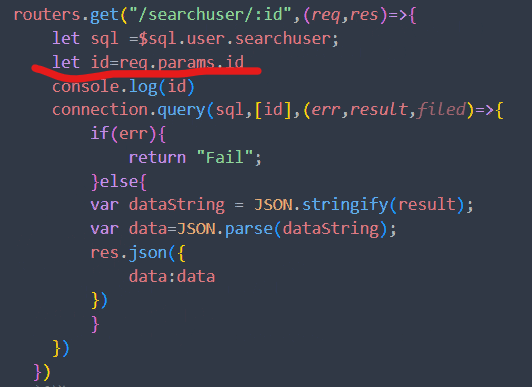

# 2021-2022学年第2学期

# **实 验 报 告**


- 课程名称:跨平台脚本开发技术
- 实验项目:  期末大作业
- 专业班级__计算1903_
- 学生学号__31901072_
- 学生姓名_高扬__
- 实验指导教师:郭鸣

## 实验内容

1. 项目分工表格

   | 姓名 |   学号   |     班级 | 任务 | 权重 |
   | :--- | :------: | -------: | ---: | ---: |
   | 高扬 | 31901072 | 计算1903 | 全部 |    1 |
2. 项目自我评估表

   | 技术点               | 自评等级:(1-5) | 备注       |
   | :------------------- | :------------: | ---------- |
   | vue                  |       5       |            |
   | el-ui                |       5       |            |
   | UI 响应式设计        |       5       | 支持移动端 |
   | 服务端 NodeJs框架    |       5       | express    |
   | Mysql                |       5       |            |
   | 增删改查             |       5       |            |
   | 文件传输（更换头像） |       5       | el-upload  |
3. 提交日记：

   
4. 项目说明

   1. 项目 是独立开发
   2. 分为前端与后端，后端通过nodejs结合express框架与mysql框架，来实现从数据库获取数据，并且传递给前端。前端通过vue中el-ui来进行编写。通过其axios获取后端提供的数据。其中前端分为管理员与用户两个方面，用户中2048游戏代码参考了网络上部分的2048教程。
   3. 后端：项目目录
      数据库：

      ```
      app.js 主启动程序 mysql.js 数据库连接 routers.js各个路由 sqlMap.js 
      ```
   4. 前端：项目目录

      ```
      js文件夹：rem.js设置设备rem宽高,touch.js触摸屏幕相应动作，其余为头像与icon库
      vue文件夹：assets：图片，components：组件页面，LoginView：登录界面，RankView：排行表，router：路由，admin：管理员页面自上而下分别为HomeView：主页，InsertView：插入新用户,SearchView：查找用户（包含删改）user：GameView：2048页面 HomeView：主页
      ```
   5. 前端启动：`npm run serve`

      

                 			查：增：

      排：

      用户界面：点击后弹出文件选择
   6. 后端启动：`node app.js`

      

      ```js
      //app.js
      var express=require('express')
      var app=express();
      var connection=require("./mysql")
      var router=require("./routers");
      var bodyParser = require('body-parser');
      app.use(bodyParser.json());
      app.use(bodyParser.urlencoded({ extended: false }));
      app.use(express.json());
      app.use('/',router);

      connection.connect((err)=>{
          if(err)throw err;
          console.log("--[connected to database successfully]--")
      });
      app.listen(8888,()=>{
          console.log("--[Server started successfully] at port: 8888--")
      })


      ```
      ```js
      //routers.js
      var express=require('express');
      var bodyParser = require('body-parser');
      var routers=express.Router();
      const { query } = require('./mysql');
      var connection=require('./mysql');
      var $sql=require('./sqlMap')
      /**登录 */
      routers.post("/login",(req,res)=>{
            let id = req.body.userid;
            let password = req.body.password;
            let sql=$sql.user.login;
            console.log(req.body)
            //console.log(sql);
            connection.query(sql,[id,password],(err,result,filed)=>{
                if(err){
                    return "Fail";
                }else{
                var dataString = JSON.stringify(result);
                var data=JSON.parse(dataString);
                console.log(data)
                res.json({
                    msg:data
                })
                }
            })
        })
      //   查询全员
      routers.get("/findAll",(req,res)=>{
        let sql =$sql.user.findAll;
        //console.log(sql);
        connection.query(sql,(err,result,filed)=>{
            if(err){
                return "Fail";
            }else{
            var dataString = JSON.stringify(result);
            var data=JSON.parse(dataString);
            res.json({
                msg:data
            })
            }
        })
      })
      //查询
      routers.get("/searchuser/:id",(req,res)=>{
          let sql =$sql.user.searchuser;
          let id=req.params.id
          console.log(id)
          connection.query(sql,[id],(err,result,filed)=>{
              if(err){
                  return "Fail";
              }else{
              var dataString = JSON.stringify(result);
              var data=JSON.parse(dataString);
              res.json({
                  data:data
              })
              }
          })
        })
      //新增
      routers.post(`/insert`,(req,res)=>{
          let sql =$sql.user.insertuser;
          let id =req.body.userid
          let name=req.body.username
          let password = req.body.password
          let status=req.body.status
          let baned=req.body.baned
          let score =req.body.score
          console.log(req.body)
          connection.query(sql,[id,name,password,status,baned,score],(err,result,filed)=>{
              if(err){
                  return 'insert Fail'
              }
              else{
                  res.json(result)
              }
          })
        })
      // 删除
      routers.delete(`/delete/:id`,(req,res)=>{
          let id=req.params.id;
          //console.log(id)
          let sql =$sql.user.deleteuser;
          connection.query(sql,id,(err,result,filed)=>{
              if(err){
                  return "Fail";
              }
              else{
                  //console.log(result)
                  res.json(result)
              }

          })
      })
      //修改
      routers.put(`/updateuser`,(req,res)=>{
          let id =req.body.userid
          let name=req.body.username
          let password = req.body.password
          let status=req.body.status
          let baned=req.body.baned
          console.log(req.body)
          let sql = $sql.user.updateuser;
          console.log(sql)
          connection.query(sql,[name,status,password,baned,id],(err,result,filed)=>{
              if(err){
                  return 'update Fail'
              }
              else{
                  res.json(result)
              }
          })
      })
      //更新分数
      routers.put(`/updatescore`,(req,res)=>{
          let id =req.body.id;
          let score=req.body.score;
          let sql = $sql.user.updatescore;
          console.log(req.body)
          connection.query(sql,[score,id],(err,result,filed)=>{
              if(err){
                  return 'update Fail'
              }
              else{
                  res.json(result)
              }
          })
      })
      //rank
      routers.get(`/rank`,(req,res)=>{
          let sql = $sql.user.rank;
          connection.query(sql,(err,result,filed)=>{
             // console.log(result)
              if(err){
                  return "RankFail";
              }else{
              var dataString = JSON.stringify(result);
              var data=JSON.parse(dataString);

              res.json({
                  msg:data
              })
              }
          })
      })
      module.exports=routers;
      ```
      ```js
      var mysql=require('mysql')//mysql
      var connection=mysql.createConnection({
          host:'localhost',
          port:'3306',
          user:'root',
          password:'123',
          database:'js',
      });

      module.exports=connection;
      ```
      ```js
      //sql
      var sqlMap={
          user:{
              login:'select * from userinfo where userid=? and password=?',
              findAll:'select * from userinfo',
              insertuser:"insert into userinfo (userid,username,password,status,baned,score) values(?,?,?,?,?,?)",
              updateuser:"update userinfo set username=?,status=?,password=?,baned=? where userid=?",
              deleteuser:"delete from userinfo where userid = ?",
              searchuser:"select * from userinfo where userid=?",
              rank:"SELECT * FROM userinfo WHERE status= 'user' ORDER BY score desc",
              updatescore:"update userinfo set score=? where userid=?",
          }
      }
      module.exports=sqlMap;
      ```
5. 解决技术要点说明

   - 解决从数据库录入头像问题，一开始在数据库中我写的是相对路径并且图片在assets文件夹中，以至于识别出是字符串，无法查找到对应的图片。随后将图片存入public文件夹中，并且数据库中直接使用图片名称，通过：src动态读取
   - 解决后端express框架无法读取前端传递的body问题，使用body-parser

     
   - 有时候前后端使用get获取的body会是{}或者undefined，换为post后解决
   - 当传入的内容包含在地址中需要使用params去传递
6. 心得体会（结合自己情况具体说明）

   - 大项目开发过程心得
     - 一开始做大作业的时候,写了nodejs的后端，但是写了html后，查阅很多资料发现彼此之间的交互比较麻烦，要通过读取文件之类的进行交互，将后端的数据库数据传到前端来也不像vue方便。之后又转战微信小程序来做，但是因为微信小程序api一些功能的更新，导致获取账户信息头像等功能发生错误。最终想起来vue，通过vue与nodejs后端进行交互。起初使用express框架时候，因为它现在的版本将req.body单独提取了出来，而导致我一开始在使用req.body的时候，获取不到前端给的数据，随后查询发现body-parse已被单独提出去了。偶尔通过get来传输数据的时候，后端获取的数据会显示{}，或者undefined，转化为post后就可以正常显示（这个问题的原因没有研究明白)。还有如果传输的内容在地址中需要使用params。在文件传输的时候通过el-upload组件与https-request自定义一个函数来实现。
   - 本课程建议
     - 老师讲解的非常详细，除了课程本身的内容，其余内容的拓展也非常多。但有时候感觉讲的有点点快，比如ramda的内容当时听下来感觉不是很跟得上（不排除我自身理解能力薄弱因素），虽然作业中课后习题有答案，但是一些没有答案的题目，和题目中很容易希望老师也可以在下一次课中稍微讲解一下。
